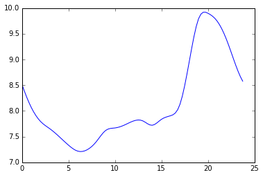

Optimization Case Study
=======================

In this section we will explore how we can use poplar to optimize the Bangladesh Solar Home System.

Background
----------

Rahima is from a small Bangladeshi village in Bogra district. Roughly 100 families live in her village.
It looks rural surrounded by rice patty fields, but Bogra district has 3.5 million people in 1119 square miles; a population density roughly the same as Delaware county. She's 25 but was married at the age of 15 and has two children; a boy Masud and a girl, Momina, ages 8 and 6.

There are a few electric lights in her village powered by Solar Home Systems. Most people use candles and kerosene lanterns. Her village has not been hooked up to the electrical grid, but there electric lines within sight. The neighboring village, only a kilometer away, has electric lines and a deep tube well.  They paid a bribe equivalent to \$10,000 USD to the relevant person that resulted in the Rural Development Board (RDB) hooking them up.  Some people in that village have illegal electrical connections; part of the very high transmission and distribution loss in the national grid.
When she makes rice, she pumps water from a tube well and boils it over an open fire with dried dung as fuel. Possible alternatives an improved cook stove using biomass is an option, as is compressed natural gas.

Rahima's younger brother Rana works as a laborer during the rice harvest and as a part-time guard the rest of the year. He is considering going to work as a laborer in the Middle East if he can arrange it. That will mean he can send a remittance back to their parents. He bought a small cell phone charger but it didn't work well and broke within 6 months. He often walks to the tea stall in the neighboring village to watch television.

Rahima's husband was tragically electrocuted working as an electrician.
She leaves her children with family and spends most of the month working in Dhaka.
The journey starts early in the morning. She walks 20 minutes to the main road and shares a small 3 wheel taxi, locally know as a CNG, to the Bogra bus station.  Occasionally it is an Electric Autorickshaw. Electric Autorickshaws's have questionable legal status, but many were imported from China a few years ago.
Dhaka is about 120 miles from Bogra, without any traffic it can be a 4 hour journey, but the only time she has ever made it that fast was shortly after the Bangladesh Riffles Revolt in 2009. The bus journey typically takes at least 6 hours.  Rahima doesn't like the bus ride; she often gets motion sickness. Last year the Eid traffic was so bad that it took 14 hours to get home. She developed a urinary tract infection because there are no toilet facilities on the bus and it stops infrequently. It is also a very scary journey. Bangladesh highways are some of the most dangerous in the world; she always sees at least one bus that has suffered a head on collision with oncoming traffic.
The journey can also be delayed by Hartal's, national strikes that shut down transportation systems.

Power outages are very common in Bangladesh, but it has been improving. # Figure \ref{fig:bd_cap}.
A few years ago the load shedding schedule was an hour on an hour off. Generators in the large buildings would kick on and blow fumes on the sidewalks she walked to from the bus station to her residence in Dhaka. The current government has been in power for six years and has installed a massive amount of new generation. Most of the new plants run on Heavy Fuel Oil (HFO) and natural gas, but several of the largest planned plants will be fueled by coal. \cite{BPDB2013}.

Rahima lives in shared housing called a mess hall.
Many women live in the same room.
They have two lights and a fan from a small business that provides supplementary  electric lines to a generator for a small monthly fee.
Rahima works for Ameena as a maid and cook.
Rahima likes her job, it is a good job, but is she is a little concerned about the future.
Ameena is almost 73,
twenty years ago that would have made her a very old woman, but now that is the average life expectancy of a woman in Bangladesh.

Some women in Rahima's mess have lost their jobs because of new washing machines and other labor saving appliances.
There are many new appliances in Bangladesh; she uses a microwave and refrigerator in Ameena's kitchen.
Ameena also has a small battery system for backup, locally known as IPS, that runs a ceiling fan and a few lights when the power goes out.
Rahima is learning to sew and that will open up options as a garment worker.

Ameena was born in Kolkata and came to Dhaka when that part of India split into West Bengal and East Pakistan. She and her husband built a 3-story house in what was then fields but is now a very good section of Dhaka.  Her husband was killed in the independence war when East Pakistan became Bangladesh. The land her house is built on is now very valuable, so her children will likely tear down the house down and a build a 7 or 8 multistory building she asses away. That process will be very challenging; there will be many bribes that need to be paid. The Renewable energy plan of Bangladesh states a target goal for developing renewable energy resources to meet ten percent of the total power by 2020. \cite{MinistryofPowerEnergyandMineralResources2008} One problem they will need to solve is the Dhaka electric utility requirement to have a PV system for lighting. They could rent a system to pass the inspection or the requirement may not even be enforced by that time.

Rahima's life is full of challenges.
Electricity is one form of energy that could improve her life.
%She wants electricity for her home where her children live in Bogra.
Electricity could be used for lighting, entertainment, communication, transportation, refrigeration, water pumping, cooking, and comfort.
She could get a micro loan for an SHS, but if the grid is extended it will be probably be cheaper for her to wait and get a grid connection, even if it is unreliable.
What is a good solution for Rahima's energy needs?

Assumptions
-----------

For this test case weather data comes from SWERA.  For the base case the annual load profile function loads.annual comes from data reported by Bangladesh's Power Development Board (BPDB) in 2013. It has been nominalized to a load relevant to a SHS load, 71.4 kWh annually. It's typical shape is seen in :ref:`bd_ave`. Developed from this base case synthetic loads will be used.

.. _bd_ave:

   mean daily base load profile

Iterating over the space of PV STC nameplate sizes of 5-200 W and Battery Effective Capacity
20-250 Wh and plotting various metrics help determine what is the nature of the
optimization problem.

Scaling
^^^^^^^
There is a scaling/sizing problem that is somewhat hard to quantify that
arises from the fact there is not a device that correlates to every possible size.

:ref:`figscale` shows how this non-linear nature shows up in system costs. In
systems that are interconnected, this issues is smoothed over by purchasing or selling
excess energy into the grid.

System per device price seems to be described by the equation.

.. math::
   \text{cost} = \lceil \frac{x}{m} \rceil (V \cdot \log \lceil \frac{x}{m} \rceil + b)

Where x is kWh, m is increment size V is volume discount constant and b is price floor constant.

.. _figscale:

.. figure:: scaling.pdf

   System price to enable a load

For this simulation we will assume that there is a device that correlates with every size.

Technology
^^^^^^^^^^
:ref:`figeta` calculated by domain.eta() shows the total efficiency of a given
sizing.
:ref:`fignl` is the sum of domain.net_l attribute showing how much energy was used for a given sizing.
:ref:`figeg` is the sum domain.g attribute and shows how much energy was
available.
Without an interconnection the excess generation is wasted.  Properly sizing
the system should maximize net load while minimizing excess generation.

Environment
^^^^^^^^^^^

:ref:`figc` shows the green house gas footprint for manufacture of device.
Both PV modules and Batteries can be
treated as commodities, power conversion electronics on the other hand does not
seem to have a well defined scaling function, thus harder to quantify.
The following equation may be a way to talk about how it scales.

.. math :: I_{T} = I_{D} + C_{0} \cdot C_{B} + C_{1} \cdot S_{PV}

Where C0 and C1 are constants with units Impact/Capacity and Impact/Watt Peak
respectively.  There are a number of dimensions that Impact could have including
Carbon Dioxide or human toxicity.

Economic
^^^^^^^^

:ref:`figP` shows how the system cost per generation is affected by
increasing battery size.  Since batteries are not an energy source increasing
battery size increases system price by extension energy price.
There seems to be a correlation with Impact.  It may be that minimizing P also
minimizes I

Risk
^^^^

:ref:`figr` is loss of load hours (LOLH).  The observation is that there is
a solution space where there are 0 LOLH for this annual load.

.. _figeta:

.. figure:: scalar_field/parm_eta.pdf

   System efficiency

.. _fignl:

.. figure:: scalar_field/parm_nl.pdf

   Loads enabled in Wh

.. _figc:

.. figure:: scalar_field/parm_c.pdf

   kg CO\ :sub:`2`\  eq

.. _figP:

.. figure:: scalar_field/parm_P.pdf

   System cost (USD)

.. _figr:

.. figure:: scalar_field/parm_lolh.pdf

   System outage

.. _figwh:

.. figure:: scalar_field/parm_wh.pdf

   Price per Wh (USD/Wh)

Ranking
^^^^^^^

Several sets of constraints arise for sizing based on these metrics.
It appears to be some balance of reliability and environmental impact or cost.

In this code we run 3 optimizations test cases.  We will look at a MPPT charge
controller (optimize.mppt) with a LOLH cost
of $1.00 and $0.07 and a simple charge controller (optimized.simple) with a LOLH
cost of $1.00.

Code
----

.. automodule:: optimize
   :members:

.. literalinclude:: ../poplar/optimize.py

Output
------

.. .. program-output:: python --help

.. include:: case1/case.rst

.. include:: case2/case.rst

.. include:: case3/case.rst

.. bibliography:: ../../../../bibtex/poplar.bib
    :cited:
    :style: unsrt
