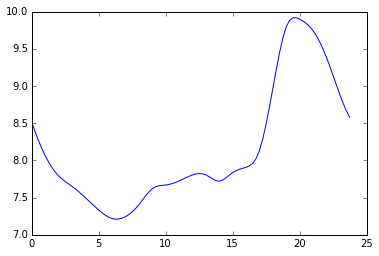

Usage
=====

In this section we will explore how we can use poplar to optimize the Bangladesh Solar Home System.

Assumptions
-----------

For this test case weather data comes from SWERA.  For the base case the annual load profile function loads.annual comes from data reported by Bangladesh's Power Development Board (BPDB) in 2013. It has been nominalized to a load relevant to a SHS load, 71.4 kWh annually. It's typical shape is seen in :ref:`bd_ave`. Developed from this base case synthetic loads will be used.

.. _bd_ave:

   mean daily base load profile

Single Domain Code
------------------

.. .. automodule:: optimize
..    :members:

.. .. literalinclude:: ../poplar/optimize.py

A single domain system described:

.. literalinclude:: case1a/case.py

.. .. program-output:: python case1/case.py

Multi Domain Code
-----------------

A multiple domain system is described, energy exporting boundaries are set and devices are given energy priorities.

.. literalinclude:: case5/case.py
    :pyobject: system

.. bibliography:: ../../../../bibtex/poplar.bib
    :cited:
    :style: unsrt
